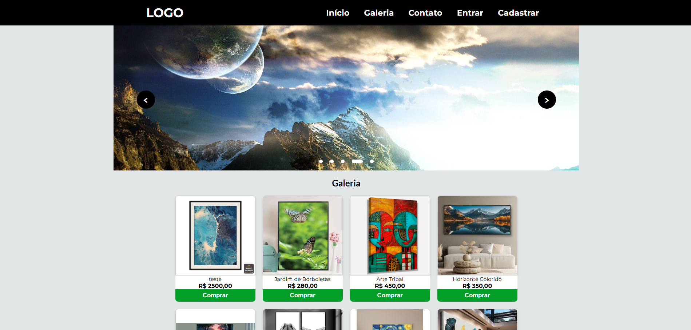
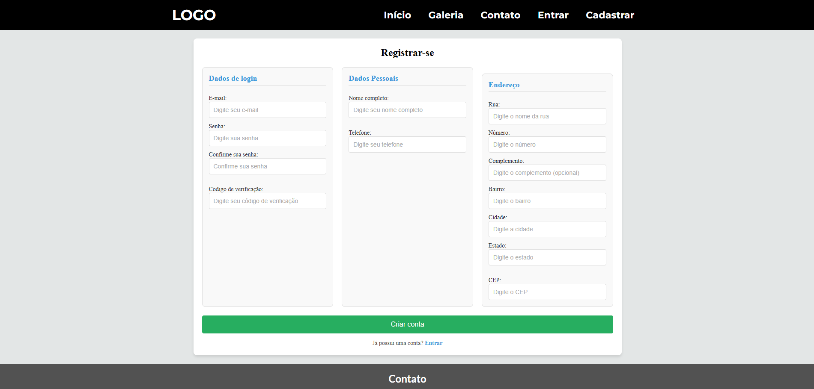
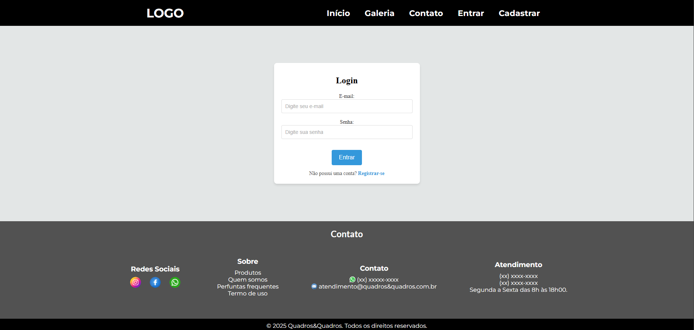
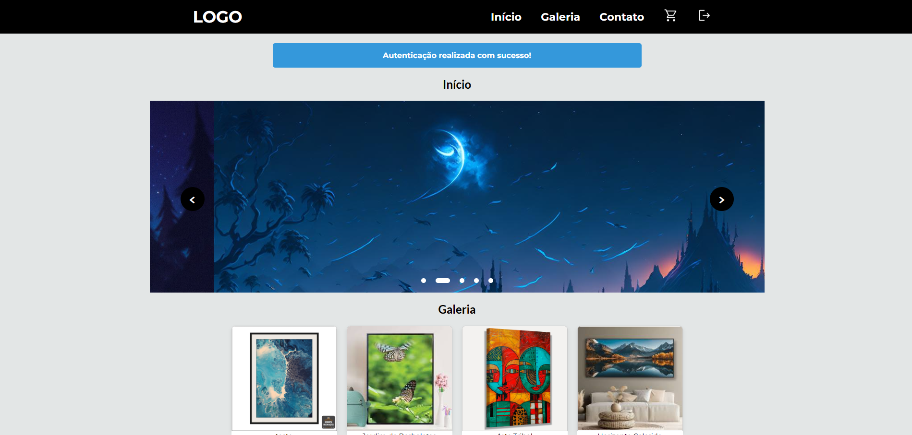
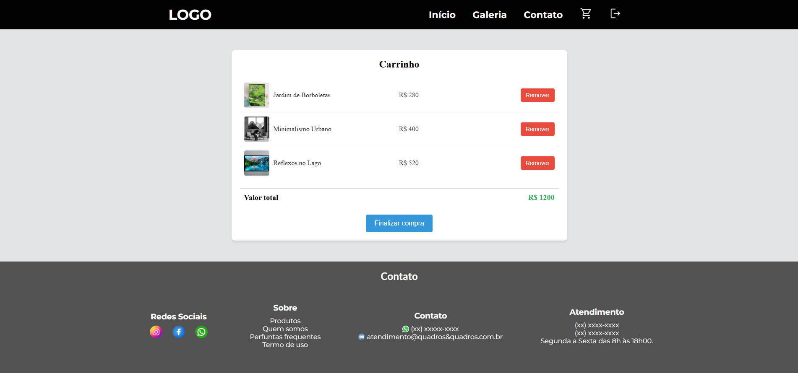
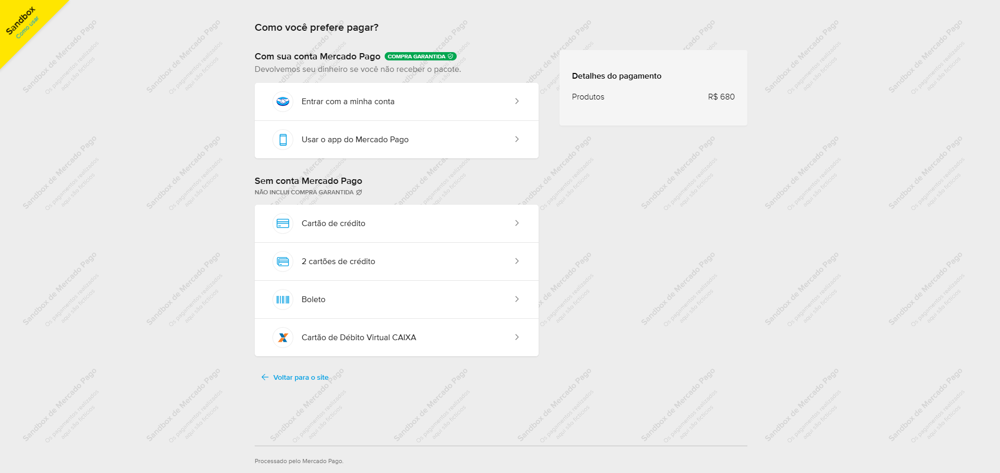
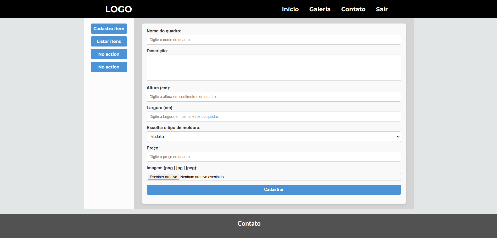
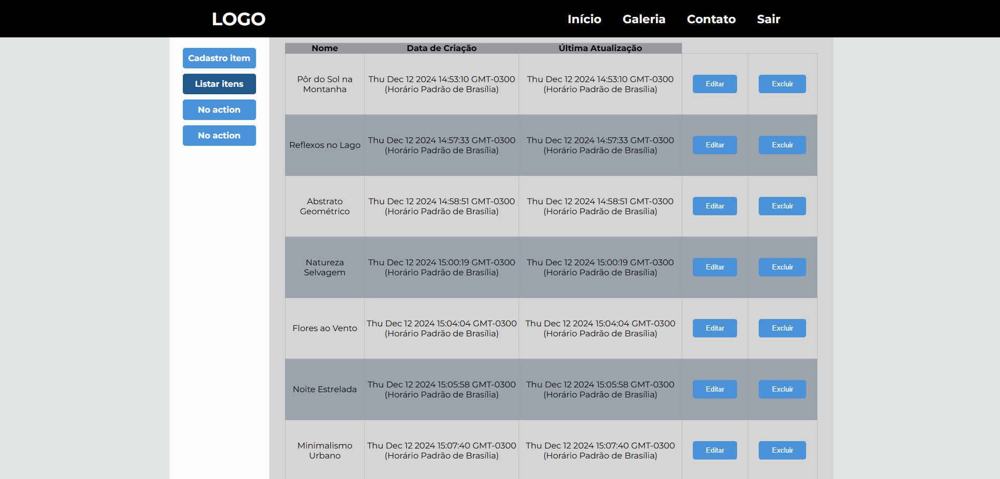

<p style='color: red'>!!!ATENÇÃO, PROJETO AINDA EM DESNVOLVIMENTO!!!</p>
# Quadros&Quadros - E-commerce de Quadros

Bem-vindo ao repositório do projeto **Quadros&Quadros**, um site de e-commerce dedicado à venda de quadros exclusivos. Este projeto está atualmente em desenvolvimento e visa proporcionar uma experiência ágil, intuitiva e personalizada para os usuários.



---

## Tecnologias Utilizadas

- **Backend**: [Node.js](https://nodejs.org/)
- **Banco de Dados**: [MySQL](https://www.mysql.com/)

---

## Funcionalidades Planejadas

- **Catálogo de Produtos**: Visualização de quadros com imagens, descrição e preço.
- **Sistema de Busca**: Filtragem por categorias, tamanhos e preços.
- **Carrinho de Compras**: Adição e remoção de produtos com cálculo dinâmico do valor total.
- **Cadastro e Login de Usuários**: Sistema de autenticação e perfil do cliente.
- **Checkout e Pagamento**: Integração com gateways de pagamento para finalização de compras.
- **Painel Administrativo**: Gerenciamento de produtos, pedidos e usuários.

---

## Como Executar o Projeto

### Requisitos

- [Node.js](https://nodejs.org/) (versão 14 ou superior)
- [MySQL](https://www.mysql.com/) (versão 8 ou superior)
- [XAMPP](https://www.apachefriends.org/) ou outro ambiente para gerenciar o MySQL, se necessário.

### Passos

1. Clone este repositório:
   ```bash
   git clone https://github.com/FelipeSDS23/Painting-sales-website.git
   cd Painting-sales-website
   ```

2. Instale as dependências:
   ```bash
   npm install
   ```

3. Configure o banco de dados:
   - Crie um banco de dados MySQL chamado `painting_sales_website`.
   - Configure o arquivo `.env` no diretório raiz com as credenciais do seu banco de dados:
     ```env
     DB_HOST=localhost
     DB_USER=seu_usuario
     DB_PASSWORD=sua_senha
     DB_NAME=painting_sales_website
     ```

4. Configure as variáveis adicionais no arquivo `.env`:
   - Crie um `SECRET` na pasta `.env` para ser usado no `express-session`.
     ```env
     SECRET=sua_chave_secreta
     ```
   - Adicione o email do administrador para receber códigos de validação de cadastro de novos administradores:
     ```env
     SYSTEM_ADMIN_EMAIL=seu_email@gmail.com
     ```
   - Configure as variáveis relacionadas ao serviço de email, preferencialmente Gmail:
     ```env
     SMTP_HOST=smtp.gmail.com
     SMTP_PORT=465
     SMTP_SECURE=true
     TRANSPORT_AUTH_USER=seu_email@gmail.com
     TRANSPORT_AUTH_PASS=sua_senha_de_app_do_email
     ```
   - Adicione a variável para integração com o gateway de pagamentos Mercado Pago:
     ```env
     TOKEN_MERCADO_PAGO=seu_token_mercado_pago
     `````

5. Inicie o servidor:
   ```bash
   npm start
   ```

6. O servidor estará disponível em `http://localhost:3000`, a página do administardor pode ser acessada em `http://localhost:3000/admin/`.

---

## Roadmap

- [x] Configuração inicial do projeto
- [x] CRUD de produtos
- [x] Sistema de login e autenticação
- [x] Integração com gateway de pagamento
- [] Desenvolvimento da interface do usuário
- [] Adição de filtragem por categorias, tamanhos e preços
- [] Integração com api para calculo de frete

---

7. Screenshots:

* Registro de usuário


* Login de usuário


* Autenticação de usuário


* Carrinho de compras


* Conexão com mercado pago


* Painel de administrador 1


* Painel de administrador 2
